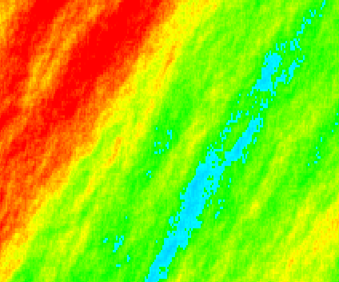
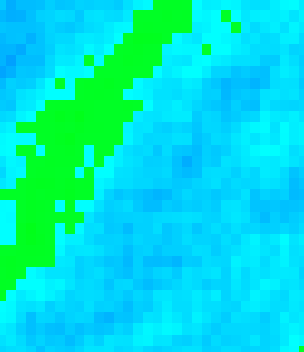
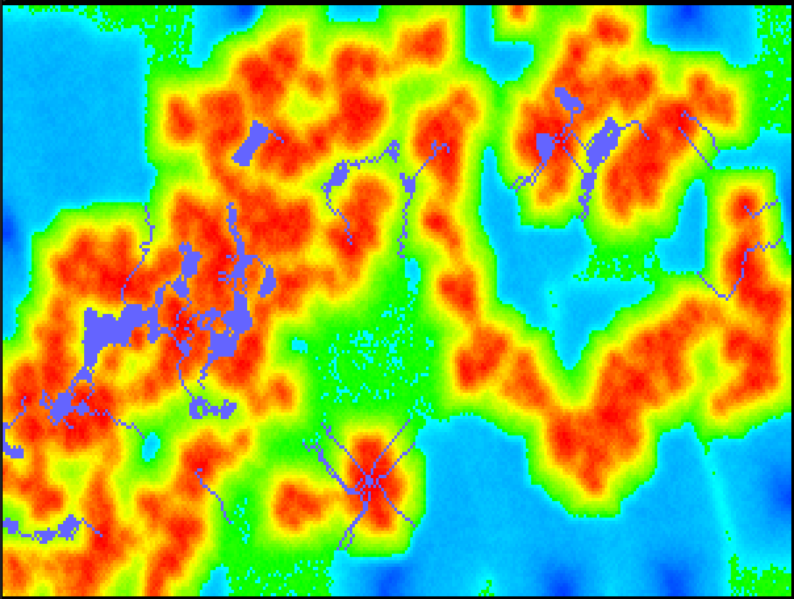
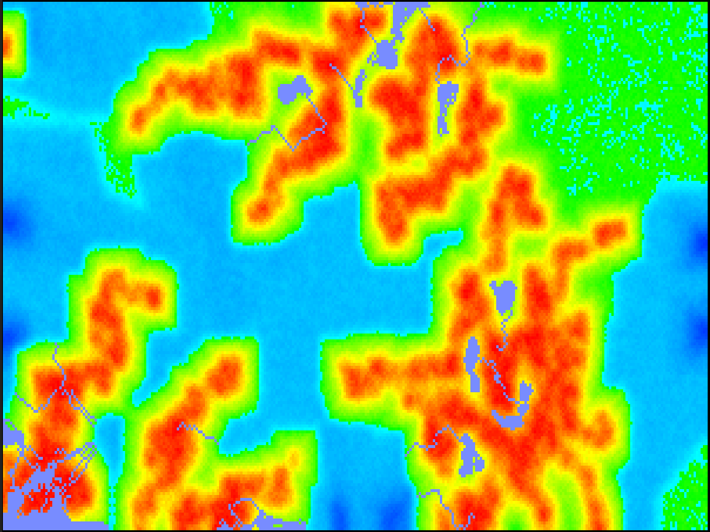

# Map Generator

A group of 4 people and one goal in mind - create a map generator.

This repository is the result of our attempt to create something cool in a very limited time.
We wanted to work on this project for 12 hours in total, split into 2 days of coding.

### How do I run it?
```shell
mvn package | java -jar target/mapGenerator-1.jar
```

## Day 1 summary: 
During our first 6 hours we planned what we want to achieve, and we talked about how we should split tasks among team 
members. One of us was delegated to create the class structure alongside some basic util functions and classes, while
others went to discuss and implement the core of our application - generation of lowlands, highlands, mountains and oceans.
After that with very little time left we've done some pair programming. One pair implemented river system, when other
took care about the deserts. 

Full picture:



Close up:




## Day 2 summary:
Day one ended with few functionalities, that were not yet integrated, so the second day of our coding challenge started
with us merging everything. We continued to work in pairs. 

Team that was responsible for the river generation system was now responsible for fixing it, because it randomly 
thrown an exception. After that they went on to improve the core of the app.
The previous version of the algorithm created really linear structures. Now, thanks to a little randomization, we get
more interesting maps. The dark blue lines and areas on the land are our lakes and rivers. They got a different
color, so it would be easier to see them clearly.




Team that on day one was responsible for deserts moved to forest generation process.